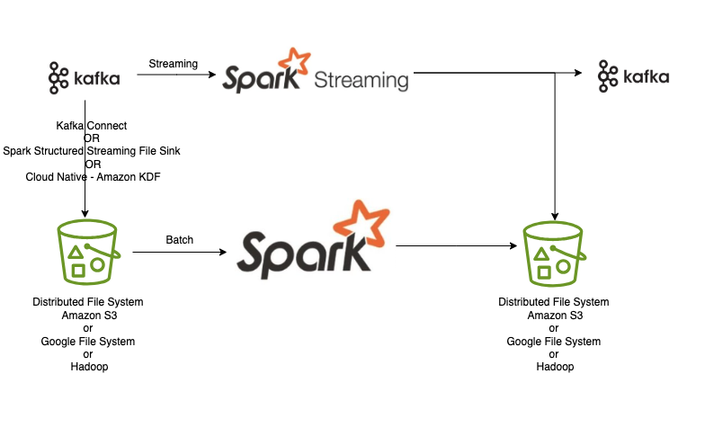

# Big Data Analytics Challenge

### Technical Architecture 

## Getting Started

*  Clone the repo and cd into the folder

    `git clone https://github.com/AnkitMishra3220/big_data_dev_challenge.git`
    `cd big-data-dev-challenge/`

* Start Kafka, Zookeeper, and Spark with Docker

 `docker-compose up`

* Create Kafka Topic view_log

    `docker exec -it big-data-challenge-kafka-1 /bin/bash`

    `kafka-topics.sh --create --topic view_log --bootstrap-server localhost:9092 --partitions 1 --replication-factor 1`

* Run the Kafka Simulator to Produce Messages

    
   `docker exec -it big-data-challenge-spark-1 python /main/kafka_simulator.py`

* Run the Spark Structured Streaming Job

`docker exec -it big-data-challenge-spark-1 spark-submit /main/campaigns_stream.py`

* View the Output Files

`docker cp big-data-challenge-spark-1:/resources/output/campaignStreaming ./output`

* View the Output in the output Kafka Topic 

`kafka-console-consumer.sh --bootstrap-server localhost:9092 --topic view_log_output --from-beginning`

